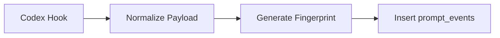
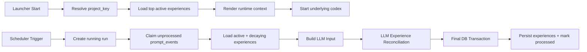
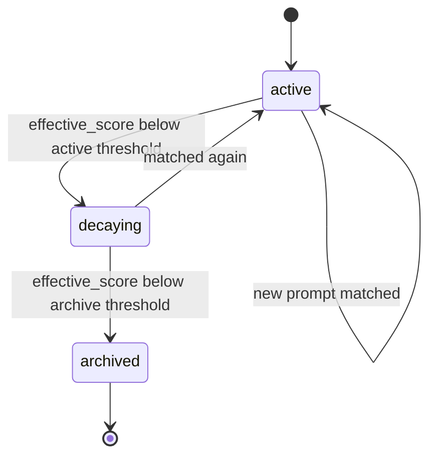

# Technical Design: Codex Hook Memory Learning

## Context

### Current State

- 当前仓库刚建立 OpenSpec 结构，还没有正式实现代码
- 项目目标从 `claude-evolution` 演进而来，但不再依赖 `claude-mem`
- 新系统要直接利用 Codex hooks 收集用户 prompt
- 学习结果需要在每次启动 Codex 时动态注入到本次会话上下文中

### Proposed State

系统形成一条轻量闭环：

1. Codex hooks 采集用户 prompt
2. prompt 事件进入本地数据库
3. 周期性任务取出新增 prompt 和现有经验
4. LLM 对经验库执行经验重整
5. 程序根据经验重整结果更新经验生命周期
6. 根据最新经验渲染项目级运行时上下文
7. 启动底层 `codex` 并注入该上下文

### Constraints

- 必须以本地数据库作为事件和经验的持久化载体
- 每轮总结都要把“已有经验 + 新 prompt”一起交给 LLM
- 未命中的旧经验不能错误刷新 `last_seen_at`
- 运行时上下文必须由当前项目经验动态渲染，不依赖静态全局文件托管
- 首版仍应保持实现轻量，不引入复杂 Web UI 或远程服务

## Goals / Non-Goals

### Goals

- 基于 Codex hooks 建立 prompt 事件采集链路
- 用本地数据库保存 prompt 事件、经验、运行记录和启动注入相关元数据
- 实现周期性的经验重整
- 基于 `last_seen_at` 实现经验衰减和归档
- 通过 wrapper 启动命令将经验动态注入到底层 Codex 会话

### Non-Goals

- 不采集 assistant reply、tool call、文件 diff
- 不做人工审核界面
- 不做多用户或多设备同步
- 不在首版做复杂冲突检测或交互式 merge
- 不通过全局 `AGENTS.md` 做托管、恢复或卸载清理

## Decisions

### Decision 1: 使用本地 SQLite 作为主存储

**选择**：所有核心运行数据统一落到本地 SQLite。

**Rationale**

- 用户已明确希望“收集 prompt 后存个数据库”
- 对 npm 包分发场景更友好，不依赖外部服务
- 比 JSON 文件更适合追加事件、按时间窗口查询、记录运行状态
- 便于后续增加索引、迁移和数据清理逻辑

**Alternatives Considered**

- JSON 文件：实现简单，但查询、去重、状态管理会迅速变复杂
- 远程数据库：超出首版轻量目标

### Decision 1.1: `project_key` 优先使用 Git root，缺失时退回当前目录

**选择**：项目边界优先由当前目录向上查找到的 Git root 决定；若不存在 Git root，则使用当前启动目录。

**Resolution Rule**

1. 从当前启动目录开始向上查找 `.git`
2. 若找到 Git root，则使用其规范化绝对路径作为 `project_key`
3. 若未找到 Git root，则使用当前启动目录的规范化绝对路径作为 `project_key`
4. 额外记录本次启动的 `launch_cwd`

**Rationale**

- 更符合开发者对“一个项目”的自然认知
- 避免同一仓库下不同子目录被错误拆成多个经验空间
- 对绝大多数代码仓库零配置可用
- 没有 Git 的临时目录也能正常工作

**Non-Goals**

- 首版不处理 monorepo 子包级项目边界
- 首版不要求用户手动配置 project key

### Decision 2: Prompt 事件采用 append-only 模型

**选择**：每次 hook 收到用户 prompt，写入一条不可变的 `prompt_events` 记录。

**Rationale**

- 原始事件作为学习系统的 source of truth
- 避免后续 reconciliation 覆盖历史证据
- 便于调试“某条经验为什么被更新”

**Write Rule**

- 只新增，不原地修改
- 用 `ingested_at` 和 `created_at` 分开记录接收时间与事件时间
- 为每条事件生成幂等指纹，避免 hook 重试造成重复写入

### Decision 3: 经验重整按周期触发，不做逐条实时归纳

**选择**：由定时任务周期性触发经验重整，默认按时间窗口处理新增 prompt。

**Rationale**

- 与用户最初设想一致：“隔一段时间总结一下”
- 比逐条实时归纳更省 LLM 成本
- 能让 LLM 在一批 prompt 上做更稳定的主题归并

**Behavior**

- 仅当存在新的 `prompt_events` 时触发 LLM
- 每轮处理一段未消费事件窗口
- 每轮都读取当前 active / decaying experiences

### Decision 4: LLM 负责语义重整，程序负责生命周期落库

**选择**：把职责拆成两层。

**LLM Responsibilities**

- 判断新 prompt 命中了哪些已有经验
- 合并重复或相近经验
- 发现新增经验
- 给经验排序
- 输出结构化经验重整结果

**Program Responsibilities**

- 更新 `first_seen_at`
- 更新 `last_seen_at`
- 更新 `hit_count`
- 更新 `last_reconciled_at`
- 应用衰减公式
- 决定状态迁移（active / decaying / archived）

**Rationale**

- 让 LLM 只做擅长的语义理解与归并
- 把时间和状态规则留在程序里，确保行为稳定、可测试

### Decision 5: 未命中经验保留但不刷新时间

**选择**：如果某条已有经验本轮没有被任何新 prompt 命中，则：

- 保留该经验
- 不更新 `last_seen_at`
- 不增加 `hit_count`
- 仅更新 `last_reconciled_at`

**Rationale**

- 这是时间衰减成立的前提
- 防止经验重整本身把旧经验“续命”

### Decision 6: Active experience 集保持小而精，并限制运行时注入上下文的数量

**选择**：LLM 每轮看到的是当前活跃经验集，而不是无限增长的全量历史经验。

**Rationale**

- 用户的核心需求是“记住活的经验，并让过期经验淡出”
- 这样可以控制 prompt 长度和 LLM 成本
- 归档经验不直接参与每轮重整

**Policy**

- `active` 和 `decaying` 经验参与经验重整
- `archived` 经验仅作历史记录，不进入每轮 LLM 输入
- 默认 `active` 经验上限为 `50`
- 写入运行时上下文的经验上限为排序前 `20`

**Rationale**

- `50` 条 active 经验足够支撑近期记忆，同时仍可控制 LLM 输入长度
- `20` 条运行时注入经验能降低上下文噪音，避免把低价值经验长期暴露给模型

### Decision 6.1: 事件消费采用“认领 + 最终事务提交”模型

**选择**：prompt 事件的消费分为两个阶段：

1. 先认领一批待处理事件
2. 再在最终事务中统一提交 experience 更新和 event 完成标记

**Runtime Rule**

- 创建 `reconciliation_runs` 记录，状态为 `running`
- 在短事务中挑选未处理事件，并写入：
  - `claimed_by_run_id`
  - `claimed_at`
- 在事务外调用 LLM 做经验重整
- LLM 返回后，开启最终事务，一次性提交：
  - experience upsert / merge / archive
  - prompt event 标记为 `processed`
  - run 标记为 `succeeded`

**Rationale**

- 避免使用脆弱的全局游标
- 避免“experience 已更新，但 event 未标记完成”的半成功状态
- 即使进程在 LLM 调用前后崩溃，也不会丢失事件，只会重试

**Concurrency Rule**

- 首版同一个 `project_key` 同时只允许一个 `running` run
- 如果已有 `running` run，新的调度周期直接跳过

**Recovery Rule**

- 若某批事件 `claimed_at` 超过超时时间且 run 未成功，则视为可重新认领
- 超时 claim 在下一轮经验重整中可重新进入候选批次

### Decision 7: 通过 wrapper 启动底层 `codex`

**选择**：用户通过项目包装命令启动 Codex，而不是直接裸用 `codex`。

**Runtime Rule**

- wrapper 启动时先读取当前目录
- 解析 `project_key`
- 读取该项目的 active experiences
- 渲染本次会话的动态上下文
- 启动底层 `codex`

**Rationale**

- 这是实现“按当前目录动态注入项目经验”的前提
- 避免修改用户全局静态配置文件
- 使项目经验注入与当前工作目录天然绑定

### Decision 8: 动态注入优先走指令层，启动 prompt 作为回退

**选择**：运行时上下文优先通过更接近指令层的方式注入；如果该通道在实现中不可行，则退回到启动 prompt 注入。

**Preferred Path**

- 优先尝试 `developer_instructions` 一类的指令层注入

**Fallback Path**

- 退回为 wrapper 在启动底层 `codex` 时附加首条动态 prompt

**Rationale**

- 指令层注入比首条用户消息更干净
- 首条 prompt 注入仍可作为 MVP 兜底
- 先把架构和渲染器定下来，再在实现时验证最终注入通道

## Data Model

### Table: `prompt_events`

| Field | Type | Notes |
|------|------|------|
| `id` | text | 主键 |
| `fingerprint` | text | 幂等指纹，唯一 |
| `project_key` | text | 工作区标识 |
| `launch_cwd` | text | 本次启动目录 |
| `session_id` | text nullable | hook 可提供时记录 |
| `thread_id` | text nullable | hook 可提供时记录 |
| `prompt_text` | text | 用户原始输入 |
| `source` | text | 固定为 `codex-hook` |
| `created_at` | datetime | 事件时间 |
| `ingested_at` | datetime | 入库时间 |
| `metadata_json` | text nullable | cwd、hook payload 摘要等 |
| `claimed_by_run_id` | text nullable | 当前认领它的 run |
| `claimed_at` | datetime nullable | 认领时间 |
| `processed_by_run_id` | text nullable | 成功处理它的 run |
| `processed_at` | datetime nullable | 完成处理时间 |

### Table: `experiences`

| Field | Type | Notes |
|------|------|------|
| `id` | text | 主键 |
| `project_key` | text | 所属项目标识 |
| `kind` | text | `communication` / `workflow` / `architecture` / `constraint` / `general` |
| `title` | text | 经验标题 |
| `canonical_text` | text | 规范化后的可注入规则句 |
| `rationale` | text nullable | 形成该经验的简要原因 |
| `confidence` | real | LLM 原始置信度 |
| `effective_score` | real | 应用衰减后的分数 |
| `status` | text | `active` / `decaying` / `archived` |
| `first_seen_at` | datetime | 首次出现时间 |
| `last_seen_at` | datetime | 最近命中时间 |
| `last_reconciled_at` | datetime | 最近被系统处理时间 |
| `hit_count` | integer | 命中累计次数 |
| `rank_order` | integer | 当前排序 |
| `source_prompt_count` | integer | 本轮或累计关联 prompt 数 |
| `content_hash` | text | 当前语义内容指纹 |
| `archived_at` | datetime nullable | 归档时间 |

### Table: `reconciliation_runs`

| Field | Type | Notes |
|------|------|------|
| `id` | text | 主键 |
| `window_start` | datetime | 本轮窗口起点 |
| `window_end` | datetime | 本轮窗口终点 |
| `status` | text | `running` / `succeeded` / `failed` |
| `prompt_count` | integer | 本轮 prompt 数 |
| `input_experience_count` | integer | 输入经验数 |
| `output_experience_count` | integer | 输出经验数 |
| `model_name` | text | 使用的模型 |
| `created_at` | datetime | 创建时间 |
| `completed_at` | datetime nullable | 完成时间 |
| `summary_json` | text nullable | 结构化统计 |

### Table: `launcher_sessions`

| Field | Type | Notes |
|------|------|------|
| `id` | text | 主键 |
| `project_key` | text | 本次启动识别出的项目 |
| `launch_cwd` | text | 实际启动目录 |
| `context_hash` | text | 注入上下文摘要 hash |
| `started_at` | datetime | 启动时间 |
| `codex_args_json` | text nullable | 传给底层 codex 的参数摘要 |

## Flow / Lifecycle

### 1. Prompt Ingestion Flow



**Steps**

1. hook 接收到用户 prompt
2. 系统提取 `prompt_text` 和可用元信息
3. 生成幂等指纹
4. 如果指纹不存在，则写入 `prompt_events`

### 2. Experience Reconciliation Flow



**Steps**

1. 启动器先解析 `project_key`
2. 加载该项目排序最靠前的 active experiences
3. 渲染运行时上下文
4. 启动底层 `codex`

5. 定时器触发本轮经验重整
6. 创建 `running` 状态的 run
7. 在短事务中认领一批未处理 prompt events
8. 读取当前 `active` 与 `decaying` 经验
9. 组装 LLM 输入
10. LLM 输出结构化经验重整结果
11. 在最终事务中统一提交：
   - experience 更新
   - prompt event 标记完成
   - run 标记成功

### 3. Experience Lifecycle



**Rules**

- 新经验创建时进入 `active`
- 已有经验被命中时：
  - 更新 `last_seen_at`
  - 增加 `hit_count`
  - 更新排序和内容
- 已有经验未命中时：
  - 保留 `last_seen_at`
  - 只更新 `last_reconciled_at`
- 每轮对所有非 archived 经验重新计算 `effective_score`

### 4. Runtime Context Injection Lifecycle

#### Launcher Start

1. 读取当前启动目录
2. 解析 `project_key`
3. 查询该项目 top active experiences
4. 按模板渲染运行时上下文
5. 记录 `launcher_sessions`
6. 启动底层 `codex`

#### Runtime Context Rendering

注入文本使用固定 section 模板：

- `Project`
- `Communication`
- `Workflow`
- `Architecture`
- `Constraints`
- `Learned Experiences`

渲染规则：

- 每个 section 按 `kind` 分组填充
- 仅注入 `canonical_text`
- 不注入 `confidence`、`hit_count`、时间戳
- 总注入条数默认不超过 `20`
- 注入通道优先使用指令层，必要时退回到启动 prompt

## Interfaces

### Hook Ingestion Interface

```ts
interface PromptHookEvent {
  promptText: string;
  createdAt: string;
  cwd?: string;
  sessionId?: string;
  threadId?: string;
  rawPayload?: unknown;
}
```

### Reconciliation Input

```ts
interface ReconciliationInput {
  prompts: PromptEvent[];
  experiences: Experience[];
  now: string;
}
```

### LLM Reconciliation Output

```ts
interface ReconciledExperience {
  existingExperienceIds: string[];
  action: 'retain' | 'update' | 'merge' | 'create';
  projectKey: string;
  kind: 'communication' | 'workflow' | 'architecture' | 'constraint' | 'general';
  title: string;
  canonicalText: string;
  rationale?: string;
  matchedPromptIds: string[];
  rankOrder: number;
  confidence: number;
}

interface ReconciliationOutput {
  experiences: ReconciledExperience[];
}
```

### Project Resolution Interface

```ts
interface ProjectResolver {
  resolveProjectKey(cwd: string): Promise<{
    projectKey: string;
    launchCwd: string;
  }>;
}
```

### Runtime Context Rendering Interface

```ts
interface RuntimeContextRenderer {
  render(input: {
    projectKey: string;
    experiences: Experience[];
  }): Promise<string>;
}
```

### Codex Launch Interface

```ts
interface CodexLauncher {
  launch(input: {
    projectKey: string;
    launchCwd: string;
    runtimeContext: string;
    passthroughArgs: string[];
  }): Promise<void>;
}
```

## Decay Model

### Rule

系统同时保存两个分数：

- `confidence`: LLM 给出的原始语义置信度
- `effective_score`: 应用时间衰减后的当前分数

### Suggested Formula

```ts
effective_score = confidence * exp(-lambda * staleDays)
lambda = ln(2) / halfLifeDays
staleDays = days_since(last_seen_at)
```

### Default Thresholds

- `active`: `effective_score >= 0.60`
- `decaying`: `0.30 <= effective_score < 0.60`
- `archived`: `effective_score < 0.30`

这些阈值先作为默认配置，具体值可在实现时做成可调参数。

## Risks / Open Questions

### Risk 1: LLM 输出不稳定

即使输入相同，经验标题、排序和粒度也可能波动。

**Mitigation**

- 约束结构化输出
- 对 experience 内容计算 hash
- 对删除和合并操作设置程序保护规则

### Risk 2: Active experience 集增长过快

如果经验过多，每轮 reconciliation 的 prompt 成本会上升。

**Mitigation**

- 只让 `active` 和 `decaying` 进入 LLM
- 尽快归档长期低分经验
- 默认 `active` 上限固定为 `50`
- 运行时注入上下文默认只保留前 `20` 条经验

### Risk 3: 启动注入方案依赖 wrapper 入口

如果用户绕过 wrapper 直接执行裸 `codex`，则本次会话无法拿到项目级动态经验上下文。

**Disposition**

- 首版明确以 wrapper 作为正式入口
- 后续如有需要，可再研究对原生 `codex` 使用习惯的兼容方案

### Risk 4: Hook 元信息可能因 Codex 环境不同而不稳定

某些 hook 字段在不同运行环境里可能不存在。

**Mitigation**

- `prompt_text` 和时间戳是最小必需字段
- 其他字段全部视为可选元信息

### Risk 5: 事件认领后进程崩溃导致僵尸 claim

如果事件被认领后，LLM 调用或最终提交前进程退出，这批事件会暂时停留在 claimed 状态。

**Mitigation**

- 为 `claimed_at` 定义超时窗口
- 下次运行允许重新认领超时 claim
- `processed_at` 才是事件真正完成消费的唯一标记

### Risk 6: Monorepo 会被统一归到同一个 Git root

首版 `project_key` 使用 Git root 规则时，同一 monorepo 下的多个子包会共享一个经验空间。

**Disposition**

- 首版接受这一简化
- 未来若出现明确需求，再引入子项目边界识别规则

### Risk 7: 指令层注入通道可能存在实现约束

虽然架构优先假设使用更接近指令层的注入方式，但底层 Codex CLI 的可用注入接口仍需要在实现阶段验证。

**Disposition**

- 首版先固定 wrapper + runtime context renderer 架构
- 实现阶段优先验证指令层注入
- 若验证失败，则使用启动 prompt 作为兼容回退
